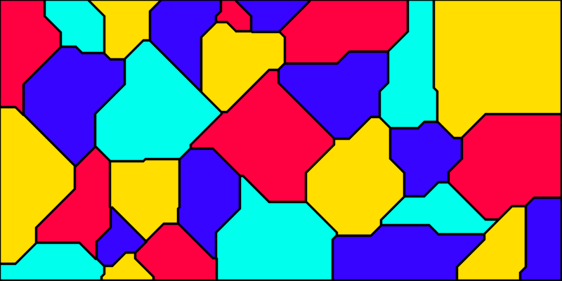

# Four Color Maps

Generate random maps and color them with only 4 colors proving the [Four color
theorem][0].

```shell
cargo run --release -- terminal
cargo run --release -- -n 30 svg
```



[0]: https://en.wikipedia.org/wiki/Four_color_theorem
